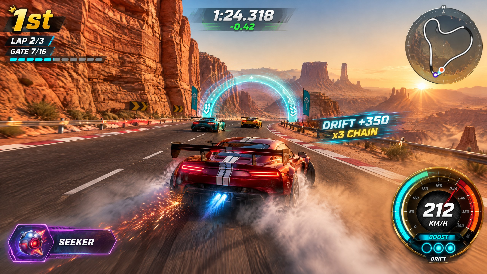
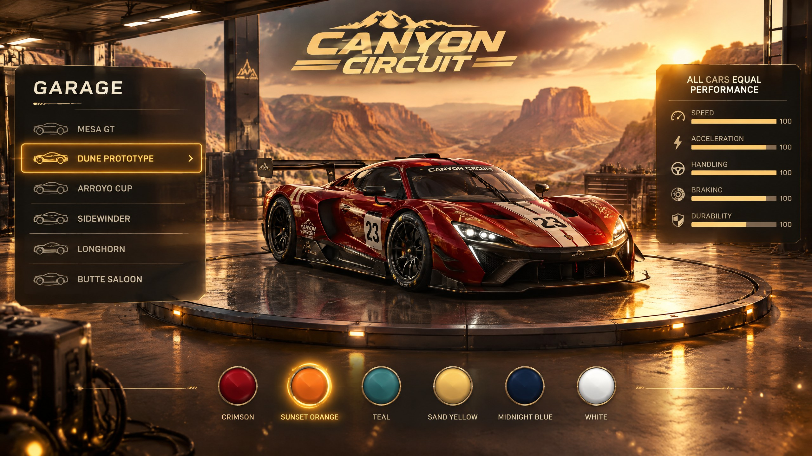
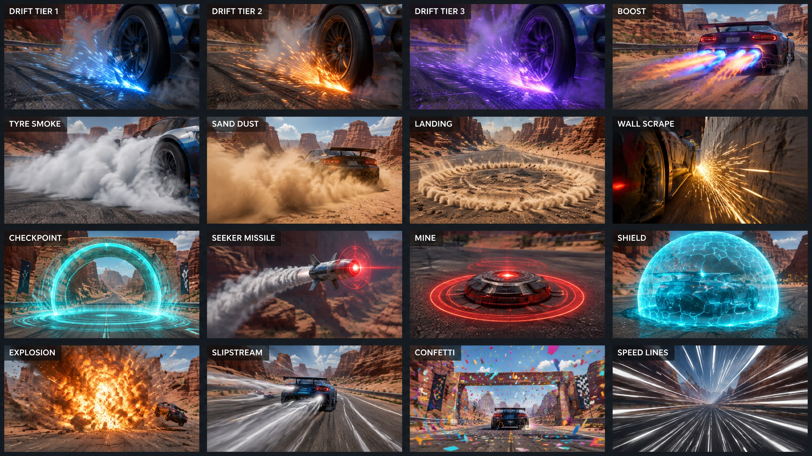
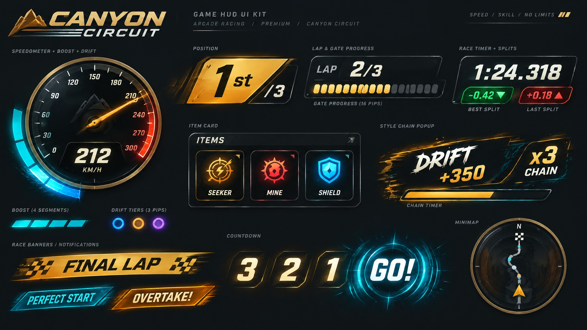

# Canyon Circuit — "Golden Hour" Upgrade Concept Proposal

## 1. What makes the genre's best games fun

| Game | Core loop | Signature mechanic | Juice & feedback that sells it |
|---|---|---|---|
| **Mario Kart 8 Deluxe** | Race → drift every corner → release boost → fight for position with items | Drift charge with **three colour-coded tiers** (blue → orange → purple sparks); charging is faster when you commit to the corner ([Vike's drift guide](https://vikemk.com/drifting-guide)) | Spark colour *is* the UI: the player reads charge state from the car, not the HUD. Every release is a satisfying burst with flame, sound and FOV kick |
| **Forza Horizon** | Drive → chain skills → bank the multiplier | **Skill chains**: drifts, air, near misses and drafting within a short window stack up to x5; crashing loses the chain ([Forza Wiki](https://forza.fandom.com/wiki/Forza_Horizon_4/Skills)) | Constant score pop-ups, rising multiplier tension, "banked" celebration |
| **Burnout Paradise / Burnout 3** | Boost → take risks → earn more boost | Boost meter filled by risky driving | Motion blur, camera shake and FOV stretch create **sense of speed**; heavy impacts get slow motion and debris |
| **Trackmania** | Attempt → instant restart → shave milliseconds | Checkpoint **split deltas** against your best, ghost racing | Green/red split flashes create a heartbeat every 10–15 s; restart is one button |
| **Horizon Chase Turbo** | Pick a track → race a pack → overtake | Pure readable arcade handling, no microtransactions | Vivid golden-hour palettes, big clean HUD, energetic synth score |
| **Hot Wheels Unleashed** | Drift/boost around stunt tracks | Drift fills boost segments; boost can be spent anywhere | Great-looking, readable cars; segmented boost bar; chunky landing feedback |

**Shared DNA:** (1) one core skill that you perform every corner (drift → boost), (2) readable state shown on the car itself, (3) a short-horizon reward heartbeat (splits, skill pops, position changes), (4) a sense of speed made of layered camera, particle and audio cues, and (5) instant retry.

## 2. Diagnosis of the current build

- **Visuals:** flat-shaded, boxy procedural cars read as toys; the terrain and cliffs are untextured low-poly shapes, so the canyon looks small; the sky is a plain gradient; particles are hard, flat quads.
- **Feedback:** drift tiers exist in the simulation but are barely visible; boost has little camera or VFX punch; gates, laps and position changes are text-only; the HUD bars are flat and inert.
- **Audio:** fully synthesized placeholder tones; no real engine character or music identity.
- **Loading:** everything loads before the title.

## 3. Upgrade pillars

1. **Golden-hour realism.** Photographic PBR sandstone, sand and asphalt (PolyHaven via the Manus catalog), original GT and prototype race cars, a painted panoramic desert sky, atmospheric haze and soft, low-glare lighting. Environment reflections and emission are kept to a minimum: rock, sand and asphalt use roughness 0.85–1.0, metalness 0 and a very low environment intensity.
2. **Read-it-on-the-car.** Drift tiers show as tyre sparks: **Tier 1 blue, Tier 2 orange, Tier 3 violet**, with growing spark volume, a tier-up flash and a chime. Boost shows as exhaust flame, heat shimmer and a light trail. Slipstream shows as visible wind ribbons.
3. **Style Chain (inspired by Forza Horizon).** Drifts, air time, trick landings, slipstreams, near misses, perfect starts and boost pads add style points. Actions within 2.5 s of each other chain, and the multiplier grows to x5. A wall hit or recovery breaks the chain. Scoring is deterministic and cosmetic only: it is shown on the HUD and in the results but never changes race outcomes.
4. **Split heartbeat (inspired by Trackmania).** Each gate shows a split delta against your personal best (green for ahead, red for behind), with a ring burst on the gate itself.
5. **Layered speed.** Speed-scaled FOV, radial speed lines, road-side dust streaks, camera shake on landings and impacts, and a boost punch: FOV kick, chromatic edge and exhaust flame.
6. **Tactile HUD.** A glass-and-brass speedometer dial with an animated needle and redline glow, a segmented boost gauge that throws sparks when a segment fills, position badges that pop and throw confetti on overtakes, a lap banner sweep, a final-lap sting, a countdown shockwave, and menu buttons that emit particle sparks on hover and press.
7. **Sound identity.** An AI-generated soundtrack (title theme, race theme, final-lap theme, results jingle) and AI-generated SFX (engine loop, skid, boost, tier-up, gates, laps, impacts, items, UI). The engine sample is pitch-mapped to speed, and a synth layer is kept as the fallback.
8. **Instant start.** The boot stage loads only the title and the first track's essentials. The remaining assets stream in the background at bounded concurrency, and prefetch pauses when frame time or VFX load rises during a race.

## 4. Feature specification

### 4.1 Cars (cosmetic only, identical physics)
The catalog paddock cars were too low-poly for the photoreal target. Each chassis now starts from a GPT Image 2 studio reference render, which is converted to a textured PBR GLB (Tripo H3.1 image-to-3D). The GLB is then optimised with glTF-Transform: quantized, WebP textures, simplified, about 0.7 MB per car.

| Chassis | Silhouette |
|---|---|
| Sandvane GT | Long-tail coupe with a towering rear wing |
| Talusfin | Closed-cockpit hypercar prototype with a shark fin |
| Gullyjack | Compact cup coupe with a short, punchy stance |
| Basaltback GT | Mid-engine GT with wide rear haunches |
| Nightmesa | Classic long-tail endurance prototype |

The generated bodies are baked white. A livery shader keeps the texture's shading and panel detail but re-hues the bright, unsaturated paint texels to the livery's primary colour. It also adds a twin racing stripe in the secondary colour along the spine. Paint uses a moderate clearcoat (0.55, roughness 0.18) and a low environment intensity, so there is no mirror glare. Headlight sprites are removed for daylight. Brake glows appear only when braking. The body rolls, pitches and squashes on landing.

### 4.2 Environment
- **Canyon walls:** triplanar-mapped `cliff_side` sedimentary rock with horizontal strata, plus a `red_sandstone_wall` detail blend and a warm tint.
- **Desert floor:** `aerial_sand` with rippled normals; `coast_sand_rocks` for the rocky shoulders.
- **Road:** `asphalt_track` PBR under painted edge lines, rumble strips and boost lanes.
- **Sky:** an AI-painted equirectangular golden-hour panorama with distant mesas, a low sun and light haze. Height fog matches the sky horizon colour.
- **Props:** photoreal generated GLBs (text-to-3D) are used for the sandstone boulders, hoodoo rock spires and saguaro cacti. They are GPU-instanced along the canyon, with per-instance tint variation. Their metalness is zero and their environment intensity is 0.3, so there is no glare. Procedural proxies are drawn until each GLB streams in.
- **Structures:** gates, the start gantry and guard rails are graphite and galvanised steel with low reflection. The only emissive accents are small cyan gate strips.
- **Items:** the generated seeker missile and hazard-striped road mine replace the primitive item meshes.

### 4.3 VFX (pooled GPU particles and soft textures)
- **Tyre and driving:** dust plumes behind tyres on sand and at speed, tyre smoke while drifting, and tier-coloured drift sparks with additive glow.
- **Boost:** exhaust flame (a textured cone flicker), heat shimmer, light trails from the tail lights and boost-pad chevron bursts.
- **Air and landings:** a landing dust ring and debris chips; a perfect-landing star burst.
- **Contact:** wall scrape sparks and camera shake; car-to-car contact sparks.
- **Gates and race moments:**
  - Gate-crossing ring shockwave and gate flash.
  - Lap confetti.
  - Finish fireworks.
  - Countdown ground shockwave.
  - Launch-perfect flame burst.
- **Items:** the seeker missile gets a smoke trail and a flare, the mine gets a pulsing warning ring, the shield gets a fresnel bubble with hex shimmer, and explosions throw debris.
- **Ambient:** heat haze and drifting dust motes near the camera.
- **HUD and menus:** spark bursts on the boost gauge, pop-in particles on style pop-ups, and hover and click sparks on menu buttons.

### 4.4 HUD layout
- **Top left:** position badge (animated) plus lap and gate progress.
- **Top centre:** race timer with the split delta flash.
- **Top right:** minimap.
- **Bottom right:** speedometer dial with the boost gauge ring and drift tier pips.
- **Bottom left:** item card.
- **Centre:** style chain counter with its multiplier.

### 4.5 Audio
| Cue | Source |
|---|---|
| Title/garage theme, race theme, final-lap theme, results jingle | Lyria music generation |
| Engine loop, drift skid loop, wind loop | ElevenLabs looped SFX; pitch and gain mapped to speed |
| Boost, tier-up, gate, lap, final lap, countdown, go, land, wall hit, item pickup, seeker launch/warn, explosion, mine, shield, recover, overtake, finish, UI hover/click/back | ElevenLabs one-shots |

### 4.6 Loading plan
| Stage | Content | When |
|---|---|---|
| Boot | Loading background, fonts, UI SFX, title music | Before the title |
| Race-critical (Canyon) | Terrain textures, sky, particle sprites, the selected car first (prioritised), then rival cars, boulders, spires, cacti, race SFX | Starts on title; Race waits with a progress state if unfinished |
| Background | Gantry, light towers, item models (seeker, mine), item icons, race/final-lap/results music | Idle time; paused while racing when frame time is above 20 ms or particle load is high |

## 5. Non-goals and invariants
- Performance must remain identical across cars. No stat progression.
- The simulation stays deterministic; the style chain is computed from simulation events and car states and never affects rules.
- Online ghost protocol unchanged.

## 6. Concept art

| Image | Shows |
|---|---|
|  | Gameplay target: golden-hour canyon, chase camera, HUD layout, drift sparks and boost flame |
|  | Garage: car turntable, livery swatches and mode cards |
|  | VFX sheet: dust, tyre smoke, tier sparks, boost flame, gate shockwave, confetti, explosions, shield |
|  | HUD kit: position badge, lap and gate pills, speedometer dial, item card and style chain |
